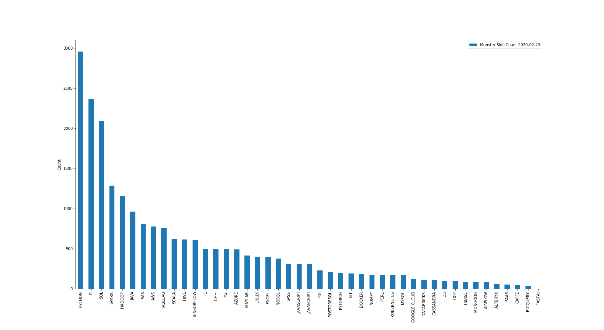

# WHAT DATA SCIENCE SKILLS SHOULD I LEARN?

The goal of this project is to determine the demand for general skills and technologies such as Python and R. Software most relevant to data science. I scraped Monster's website [link](https://www.monster.com/) for my analysis employing a wide array of tools mentioned below. The search was done nationwide (i.e across the U.S). 

I got a count of the job postings for the most in demand skills and the count is solely what my ranking is based on. I performed exploratory analysis to get a barchart of the skill count, Python seems to be the most relevant according to the plot. The ipynb also contains a function that takes user input, i.e a programming language or a skill relating to data science and extracts the first 'n' job details posted on the website at that time (n can be any number) **EXTRACT**. Transformed the data and engineered additional features to add extra insights. Some of the features generated include **TRANSFORM**:

* Actual date it was posted; 
* Day corresponding to that date; 
* Title of the role;
* Company;
* City;
* State;

Loaded the extracted informations to 2 databases. First was the schema for the count which was loaded to a POSTGRES database. The second was the schema for the job descriptions which was loaded to a MONGO database.**LOAD**

**Tools Used: Beautiful, Splinter, Matplotlib, Splinter, Calender, Datetime, SQLAlchemy, Regular Expressions, Pymongo**
